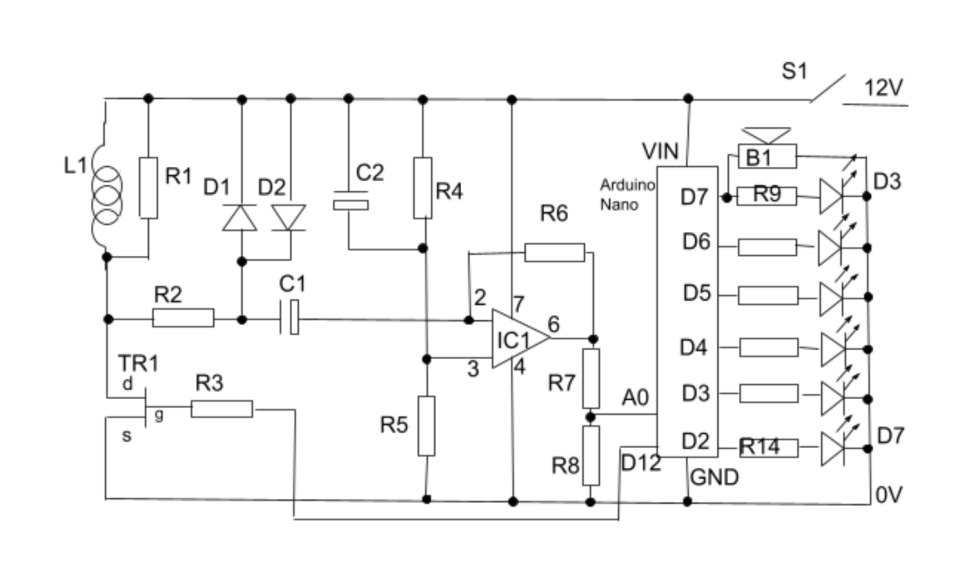

# Pulse Induction Metal Detektor
[An iteration from here](https://nicholsonelectronics.co.uk/build-a-metal-detector/) or maybe 
[here?](https://create.arduino.cc/projecthub/mircemk/diy-simple-sensitive-metal-detector-7f34ad)

